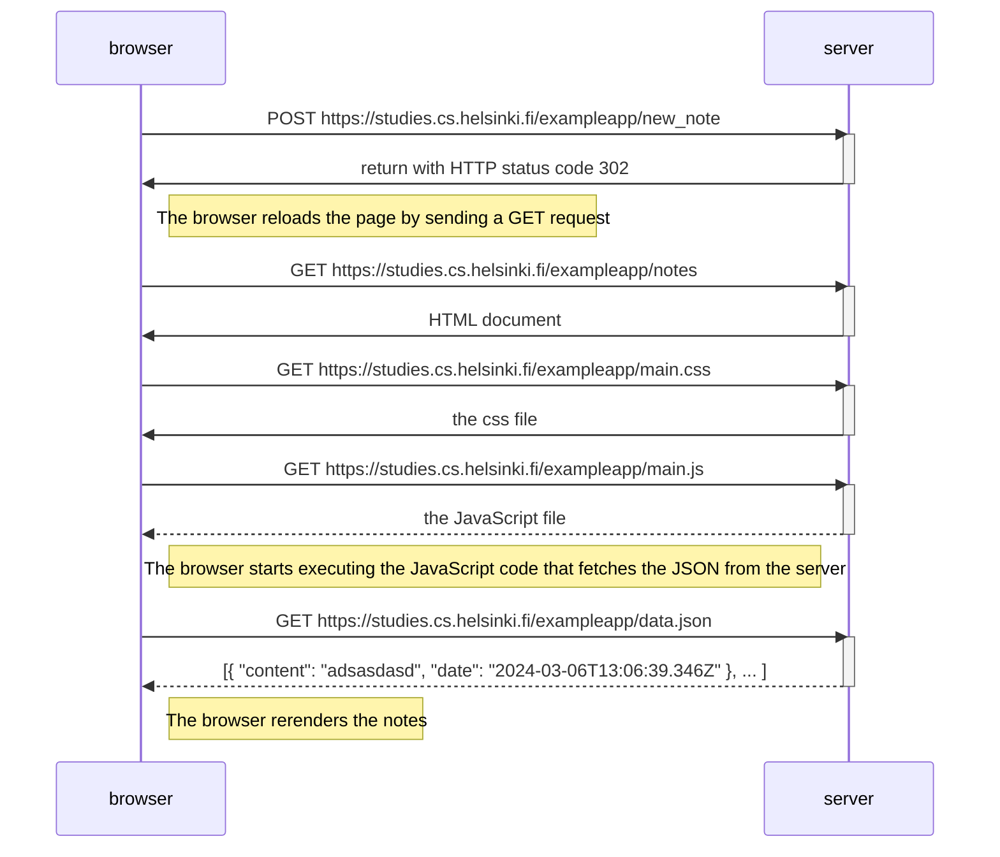

```mermaid
sequenceDiagram
	participant browser
	participant server

	browser->>server: POST https://studies.cs.helsinki.fi/exampleapp/new_note
	activate server
	server->>browser: return with HTTP status code 302
	deactivate server

	Note right of browser: The browser reloads the page by sending a GET request

	browser->>server: GET https://studies.cs.helsinki.fi/exampleapp/notes
	activate server
	server->>browser: HTML document
	deactivate server

	browser->>server: GET https://studies.cs.helsinki.fi/exampleapp/main.css
	activate server
	server->>browser: the css file
	deactivate server

	browser->>server: GET https://studies.cs.helsinki.fi/exampleapp/main.js
    activate server
    server-->>browser: the JavaScript file
    deactivate server

    Note right of browser: The browser starts executing the JavaScript code that fetches the JSON from the server

    browser->>server: GET https://studies.cs.helsinki.fi/exampleapp/data.json
    activate server
    server-->>browser: [{ "content": "adsasdasd", "date": "2024-03-06T13:06:39.346Z" }, ... ]
    deactivate server

    Note right of browser: The browser rerenders the notes

```